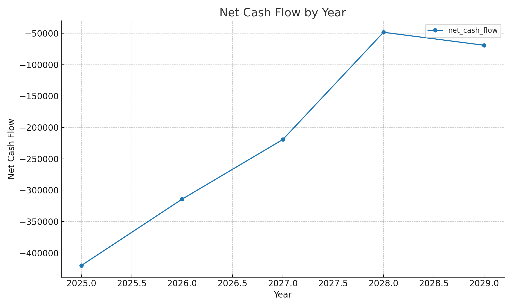

# CyberTCO — Summary

- Base Year: 2025
- Horizon: 5 years
- TCO: 4,271,117.56
- Total Benefit: 3,200,000.0
- NPV: -988,262.48
- ROI: -25.08%
- Payback Year: None

## Annual View

|   year |   capex_cash |   opex_cash |   benefit |    total_cost |   net_cash_flow |   discounted_net |
|-------:|-------------:|------------:|----------:|--------------:|----------------:|-----------------:|
|   2025 |       250000 |      810000 |    640000 |      1.06e+06 |       -420000   |        -420000   |
|   2026 |       120000 |      834300 |    640000 | 954300        |       -314300   |        -291019   |
|   2027 |            0 |      859329 |    640000 | 859329        |       -219329   |        -188039   |
|   2028 |            0 |      688418 |    640000 | 688418        |        -48418   |         -38435.8 |
|   2029 |            0 |      709071 |    640000 | 709071        |        -69070.6 |         -50768.9 |

## Charts

